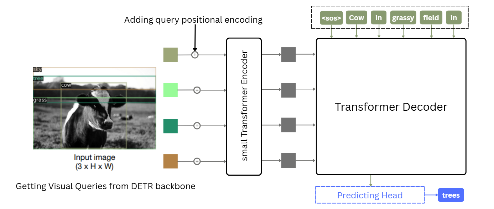
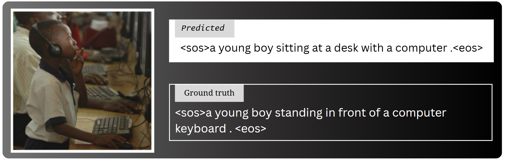
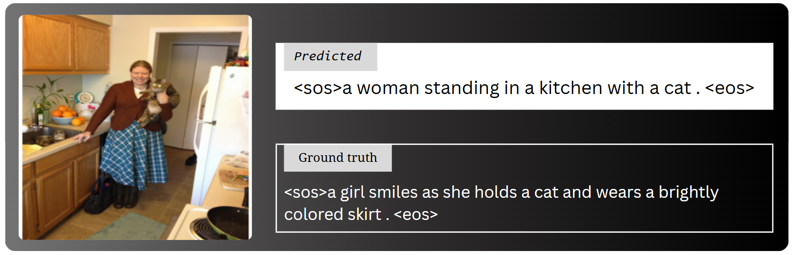

# DETR‑Powered Image Captioning
**Efficient. Interpretable. Detection‑Driven.**
<br/>
_**Read the full technical write-up:**_ [DETR-Powered Efficient Image Captioning — LinkedIn (Aug 2025)](https://www.linkedin.com/pulse/reimagining-faster-image-captioning-detr-from-regions-tanaji-umbare-e3w3c)

A blazing‑fast and smarter image captioning model built using [DETR (DEtection TRansformer)](https://arxiv.org/abs/2005.12872) to go beyond naïve patch‑based approaches.

---

## 🚀 Key Idea
Most image captioning models (e.g., ViT‑GPT2, BLIP) treat images as a flat sequence of patches and generate captions purely in a sequence‑to‑sequence manner. But **captioning is fundamentally about detecting and describing the key elements in a scene**—objects, their relationships, and context.

This work leverages DETR to:
- **Discover Regions of Interest** without hardcoded object classes.
- **Encode visual queries** via transformer layers for contextual fusion.
- **Generate captions** from those region tokens with a lightweight transformer decoder.

## 🏗️ Architecture



## 📊 Comparisons 

| Model                       | Image Resolution | BLEU‑4 Score (%) | METEOR Score (%) | Total Time (ms) |
| :-------------------------- | :--------------: | :--------------: | :--------------: | :-------------:  |
| Show & Tell             |     800 × 800    |       27.7       |       23.7       |       210*       |
| Up‑Down                 |     800 × 800    |       36.2       |       27.0       |       620*       |
| M² Transformer          |     800 × 800    |       39.1       |       29.2       |       640*       |
| ViT-GPT2          |     800 × 800    |       25.9       |       27.9       |       154       |
| BLIP-1          |     800 × 800    |       38.6       |       -       |       197       |
| BLIP-2          |     800 × 800    |       43.5       |       -        |       322       |
| **DETR‑Powered Captioning** |     **800 × 800**    |       **24.8**       |       **25.7**       |       **105**       |

*runtimes measured according NVIDIA P100, batch=1, identical default decode settings with identical image resultion approximately.


---

## Some Results 





## 🧰 Install & Run

1. Clone the repository
```bash
git clone https://github.com/SohamUmbare/DETR_powered_image_captioning.git
cd DETR_powered_image_captioning
```

2. Create a virtual environment and install dependencies
```bash
python -m venv venv
source venv/bin/activate    # on Windows: venv\Scripts\activate
pip install -r requirements.txt
```

3. Directory Structure
```bash
├── src/                    # source code
│   ├── app.py              # FastAPI inference server
│   ├── appGradio.py        # Gradio demo for HF Spaces
│   ├── config.py           # configuration settings
│   ├── detr_model.py       # loading DETR backbone
│   ├── detr_nested_tensor.py # DETR tensor utilities
│   ├── imgcap_model.py     # DETRWithCaption definition
│   ├── generate.py         # caption generation script
│   ├── evaluate.py         # evaluation script
│   ├── train.py            # training script
│   └── dataset/
│       ├── dataloader.py   # data loading pipeline
│       └── dataset.py      # dataset definitions
└── requirements.txt
```

4. Run FastAPI server for inference
```bash
cd src
uvicorn app:app --reload --host 0.0.0.0 --port 3000
```

5. Launch Gradio demo locally
```bash
python appGradio.py
```

6. Generate a caption for an image
```bash
python generate.py --image path/to/image.jpg
```

7. Evaluate on test split
```bash
python evaluate.py --config config.py
```

8. Train the model 
```bash
python train.py --config config.py
```

---

## 🤖 Live Demos & Integrations
- **Hugging Face Spaces:** [DETR Powered ImgCAP Playground](https://huggingface.co/spaces/SohamUmbare/DETR_powered_imgCAP)
- **Discord Bot:** [Try captions in real time via CAPbot](https://github.com/theSohamTUmbare/CAPbot)


## 👤 Author

**Soham Umbare**  
IIIT Raichur  
📧 cs23b1068@iiitr.ac.in

---

⭐ _If you find this work interesting, consider giving it a star on GitHub!_

---
🧑‍💻 Happy Experimenting! 🔬
